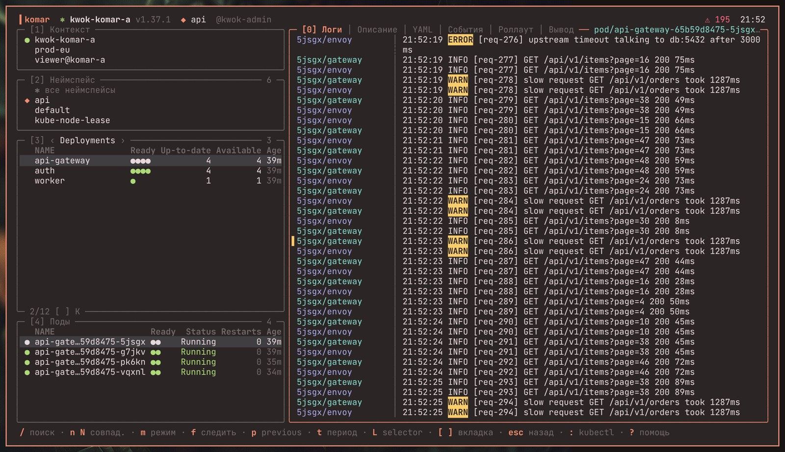

# komar

Kubernetes в терминале в стиле [Omarchy](https://omarchy.org). Цвета берутся из твоей темы, управление полностью с клавиатуры, а удаление пода сопровождается эффектом как в скринсейвере.



## Установка

```bash
git clone https://github.com/gnome627/komar && cd komar && ./install.sh
```

Работает на Arch и Debian/Ubuntu. В Omarchy komar открывается по `SUPER + SHIFT + K` или из меню, пункт «Kubernetes».

Удалить: `./install.sh --uninstall`.

## Клавиши

Полная справка внутри komar по `?`, подсказки всегда видны в нижней строке.

| | |
|---|---|
| `1` `2` `3` `4` `5` | контекст, неймспейс, ресурсы, поды, главная панель |
| `[` `]` | другой тип ресурса или другая вкладка |
| `/` | поиск |
| `enter` | зайти в под (в отдельном окне) |
| `d` | удалить |
| `s` `+` `-` | число реплик |
| `r` / `u` | перезапуск / откат |
| `l` / `e` | логи / события |
| `:` | любая команда kubectl |
| `q` | выход |
| мышь | клик выбирает панель, строку, вкладку; двойной клик как `enter`; колесо прокручивает |

В узком окне (меньше 80 колонок) видна одна колонка: списки или главная панель. `5` и `esc` переключают между ними.

## Ещё

- Настройки (необязательно): [docs/config.toml](docs/config.toml).
- Как выглядят [события](docs/screenshots/events.jpg), [удаление](docs/screenshots/delete.jpg) и [все эффекты](docs/screenshots/effects.png).
- Сборка из исходников: `make build`, тесты: `make test`.

---

*English:* a keyboard-driven Kubernetes TUI for Omarchy. Install with `./install.sh`, press `?` inside for help.
