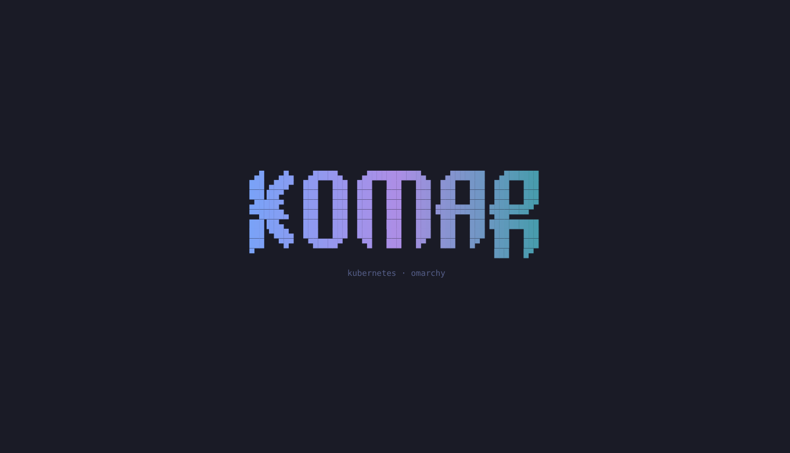
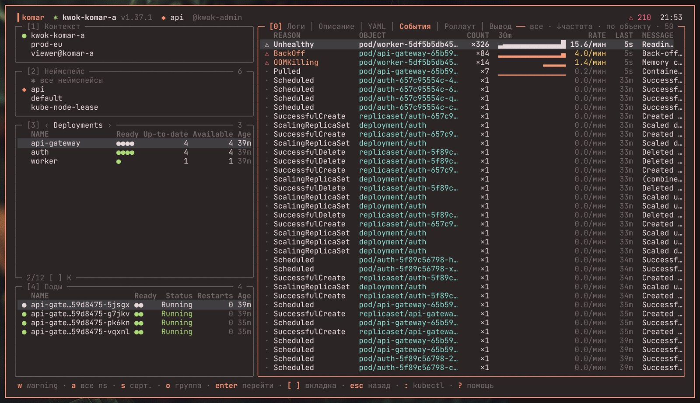
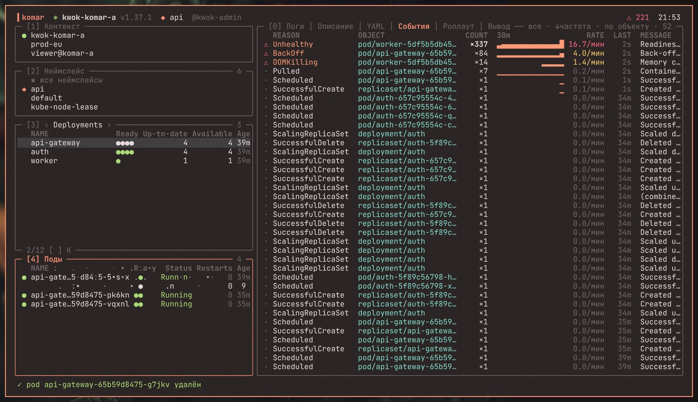
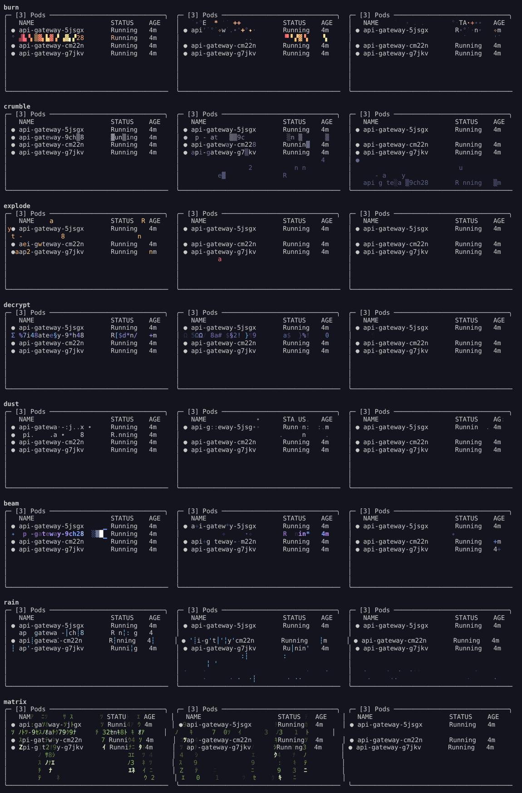

# komar

Kubernetes в терминале, в стиле [Omarchy](https://omarchy.org): панели как в lazygit/lazydocker, цвета активной темы Omarchy, эффекты удаления как в скринсейвере, всё на горячих клавишах.

```
 ▍komar  ⎈ prod-eu v1.33.1  ◆ api  @kwok-admin                              ⚠ 12  14:02
╭─ [1] Контекст ──────────────╮╭─ [0] Логи │ Описание │ YAML │ События │ Роллаут │ Вывод ─╮
│ ● prod-eu                   ││ 5jsgx/gateway │ 14:01:05 ERROR upstream timeout …        │
│   staging                   ││ 9ch28/envoy   │ 14:01:05 INFO  GET /api/v1/items 200     │
╰─────────────────────────────╯│ …                                                         │
╭─ [2] Неймспейс ─────────────╮│                                                           │
│ ◆ api                       ││                                                           │
╰─────────────────────────────╯│                                                           │
╭─ [3] ‹ Deployments › ───── 3╮│                                                           │
│   NAME          Ready   Age ││                                                           │
│   api-gateway   ●●●○    2h  ││                                                           │
│   auth          ●●      2h  ││                                                           │
╰─ 2/12 [ ] K ────────────────╯│                                                           │
╭─ [4] Поды ─────────────── 4─╮│                                                           │
│ ● api-gate…8475-5jsgx  ●●   ││                                                           │
╰─────────────────────────────╯╰───────────────────────────────────────────────────────────╯
 enter шелл · ^enter в окне · d удалить · s +- реплики · r restart · : kubectl · ? помощь
```

## Скриншоты

Тема ristretto, шрифт JetBrains Mono, тестовый кластер на KWOK. Рамка окна и обои дорисованы по настройкам Omarchy.








Все эффекты удаления (burn, crumble, explode, decrypt, dust, beam, rain, matrix):



## Что умеет

- **Контексты из `~/.kube/config` на лету**: панель `[1]` или `C`. Файл kubeconfig не меняется, у kubectl остаётся свой current-context.
- **Ресурсы в любом неймспейсе или во всех сразу**: `[2]` / `N` для неймспейса; `[ ]` листают типы (Pods, Deployments, StatefulSets, DaemonSets, Jobs, CronJobs, Services, Ingresses, ConfigMaps, Secrets, PVC, Nodes), `K` открывает все типы кластера, включая CRD. Колонки приходят с сервера (как в `kubectl get`), поэтому CRD тоже выглядят нормально.
- **Связанные объекты** в панели `[4]`: поды деплоймента/сервиса/ноды, джобы кронджобы, контейнеры пода.
- **Удаление подов, джоб и всего остального** (`d`, принудительно `D`) с эффектом как в скринсейвере Omarchy: строка сгорает, осыпается, уходит матричным дождём, взрывается, расшифровывается… Каждый раз эффект другой.
  - Подтверждение спрашивается всегда, кроме подов, у которых контроллер держит больше одной реплики.
  - Права проверяются заранее: если удалять нельзя, эффект не играет, а komar прямо пишет, какого права не хватает.
- **Реплики**: `s` открывает окно с визуализацией, `+` / `-` меняют на ±1.
- **Роллаут**: `r` делает restart, `u` показывает прогресс (новый/старый ReplicaSet) и историю ревизий; `enter` на ревизии откатывает на неё.
- **Шелл в поде**: `enter` открывает его здесь, `ctrl+enter` (или `X`) — в новом окне терминала. Перед входом komar спрашивает у API (`SelfSubjectAccessReview`), есть ли `create pods/exec`, и при нехватке прав прямо пишет, у кого какого права нет. Если в образе нет шелла (distroless), `b` запускает `kubectl debug` с ephemeral-контейнером.
- **Логи** как в stern: со всех подов и контейнеров выбранного объекта, слиты по времени, новые поды после роллаута подхватываются сами.
  - `/` — поиск по regex; `m` переключает подсветку и фильтр, `n`/`N` прыгают по совпадениям.
  - `p` — previous, `t` — период (хвост, 5м … 24ч), `L` — логи по любому label selector.
- **События кластера** удобным списком: одинаковые события свёрнуты в группу со счётчиком, мини-графиком частоты за 30 минут и скоростью в минуту. Можно сортировать по частоте (`s`), группировать по причине (`o`), оставить только warning (`w`), показать все неймспейсы (`a`). `enter` переходит к объекту.
- **Любая команда kubectl**: `:` открывает строку с историей (↑/↓) и автодополнением (tab: глаголы, типы, имена объектов, неймспейсы, флаги). `--context` и `-n` подставляются сами, если команда их не задаёт. Интерактивные команды (`edit`, `exec -it`, `logs -f`, `port-forward`) запускаются в терминале, вывод остальных попадает во вкладку «Вывод».
- **Метрики**: если в кластере есть metrics-server, в углу видна загрузка CPU/памяти кластера, а у пода — его потребление.
- **Тема**: цвета берутся из активной темы Omarchy (`colors.toml` в 4.x, `alacritty.toml` в 3.x) и меняются на лету при `omarchy-theme-set`. Вне Omarchy используется палитра терминала.
- **Язык**: русский, если в локали системы есть `ru`, иначе английский. Можно задать явно: `--lang en` или `KOMAR_LANG=ru`.

## Установка

```bash
git clone https://github.com/gnome627/komar && cd komar && ./install.sh
```

Работает на Arch и Debian/Ubuntu (и производных). Установщик:

- ставит недостающие `kubectl`, `git`, `curl`. На Arch через pacman, на Debian kubectl берётся статическим бинарником с dl.k8s.io с проверкой sha256;
- собирает komar. Если системный Go старше 1.21 или его нет, нужный тулчейн скачивается в `~/.cache/komar`;
- кладёт `komar` в `~/.local/bin` (`--prefix=DIR` меняет место);
- добавляет ярлык в лаунчер приложений (Walker в Omarchy, меню GNOME/KDE и т. п.);
- **в Omarchy** добавляет хоткей `SUPER + SHIFT + K` и пункт «Kubernetes» в меню Omarchy:
  - 4.x: `~/.config/hypr/bindings.lua` и `~/.config/omarchy/extensions/omarchy-menu.jsonc`;
  - 3.x: `~/.config/hypr/bindings.conf` и `~/.config/omarchy/extensions/menu.sh`;
- вне Omarchy добавляет хоткей `SUPER + SHIFT + K` в Hyprland или GNOME, если они есть.

Все правки в чужих конфигах обёрнуты в маркеры `>>> komar >>>`. Повторный запуск ничего не дублирует, а `./install.sh --uninstall` аккуратно всё убирает.

Флаги установщика: `--prefix=DIR`, `--from-source`, `--no-hotkey`, `--no-menu`, `--no-deps`, `--uninstall`.

## Клавиши

`?` внутри komar показывает полную справку.

| Клавиша | Действие |
|---|---|
| `1` `2` `3` `4` / `0` | панели: контекст, неймспейс, ресурсы, связанные / главная |
| `tab` / `shift+tab` | следующая / предыдущая панель |
| `j` `k` `g` `G` `ctrl+d` `ctrl+u` | движение по спискам и тексту |
| `[` `]` | тип ресурса (панель 3) или вкладка (главная панель) |
| `/` | фильтр списка или поиск в тексте |
| `C` `N` `K` | выбрать контекст, неймспейс, тип ресурса |
| `enter` | под: шелл здесь; остальное: открыть |
| `ctrl+enter` / `X` | шелл в новом окне терминала |
| `b` / `B` | `kubectl debug` здесь / в новом окне |
| `d` / `D` | удалить / удалить принудительно |
| `s`, `+`, `-` | реплики |
| `r`, `u` | rollout restart, история и откат |
| `l` `i` `y` `e` `o` | вкладки: логи, describe, yaml, события, вывод kubectl |
| `L` | логи по label selector |
| `:` | команда kubectl |
| `ctrl+r` | обновить всё |
| `q` | выход |

> `ctrl+enter` распознаётся в терминалах с keyboard protocol от kitty (foot, kitty, ghostty, alacritty, wezterm). В остальных терминалах работает `X`.

## Настройка

Файл `~/.config/komar/config.toml` необязателен. Пример лежит в [docs/config.toml](docs/config.toml).

```toml
effects = ["burn", "matrix", "decrypt"]  # из каких эффектов выбирать; по умолчанию из всех
disable_effects = false
splash = true                            # анимированный логотип при старте
debug_image = "busybox:latest"           # образ для kubectl debug
log_tail = 500                           # строк на контейнер при открытии логов
language = ""                            # "ru" / "en", по умолчанию из локали
```

Переменные окружения:

- `KOMAR_LANG` — язык интерфейса.
- `KOMAR_TERMINAL` — чем открывать новое окно, например `foot` или `alacritty -e`. По умолчанию это `xdg-terminal-exec` (как в Omarchy), затем `$TERMINAL`, затем известные эмуляторы.
- `KOMAR_THEME_DIR` — каталог темы, если она лежит не там, где её держит Omarchy.

История команд и последние неймспейсы хранятся в `~/.local/state/komar/`.

## Разработка

```bash
make build   # бинарник в ./bin/komar
make test
make run
```

Workflows для CI и релизов лежат в [docs/github-workflows](docs/github-workflows/). Чтобы включить, перенесите их в `.github/workflows`.

Код:

- `internal/kube` — client-go: таблицы с сервера, действия, логи, события, метрики.
- `internal/ui` — интерфейс на Bubble Tea v2.
- `internal/fx` — эффекты и сплэш.
- `internal/theme` — темы Omarchy.
- `internal/i18n` — строки на двух языках.

---

## English

komar is a keyboard-driven Kubernetes TUI made to feel at home in Omarchy:

- lazygit-style panels;
- colors from the active Omarchy theme, reloaded live;
- delete animations in the spirit of the Omarchy screensaver (terminaltexteffects);
- context switching from kubeconfig;
- resources in any or all namespaces;
- scale, rollout restart/undo;
- exec with an explicit RBAC check, debug containers for distroless images;
- stern-like log streaming with regex search;
- an events view with per-minute frequency sparklines;
- a raw `kubectl` prompt with history and completion.

The UI is Russian when the system locale is Russian and English otherwise.

Install with `./install.sh` on Arch or Debian-based systems. On Omarchy it also adds `SUPER + SHIFT + K` and a "Kubernetes" entry in the Omarchy menu (3.x and 4.x).
